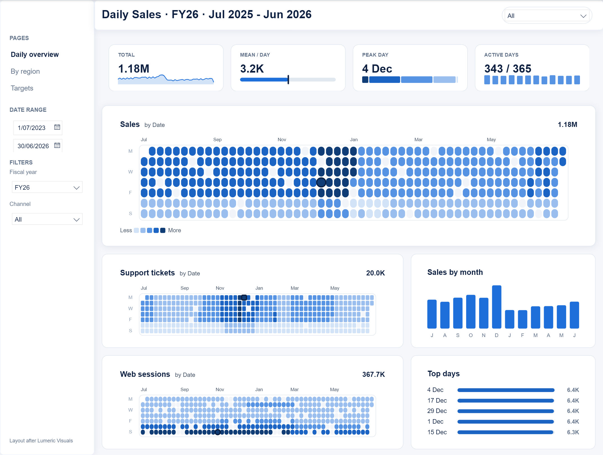
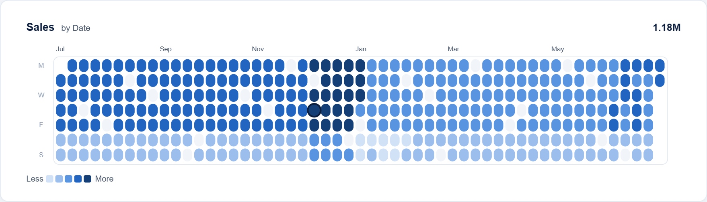
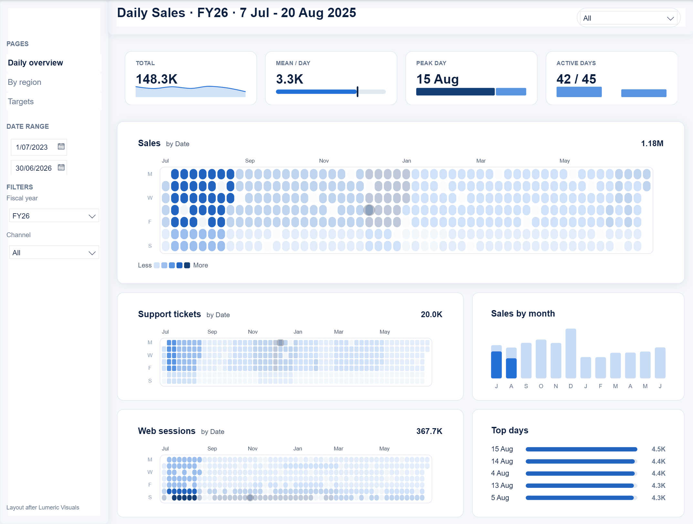
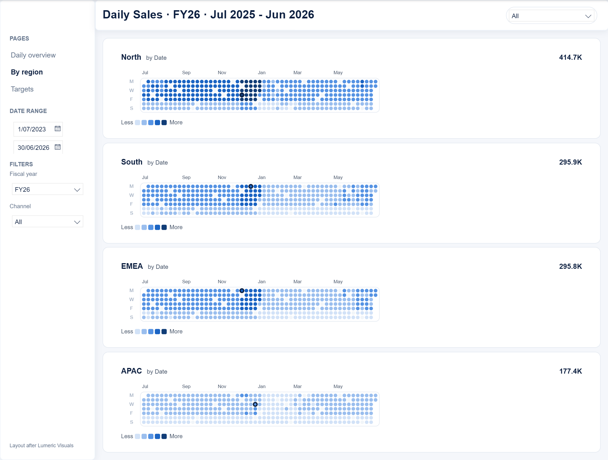
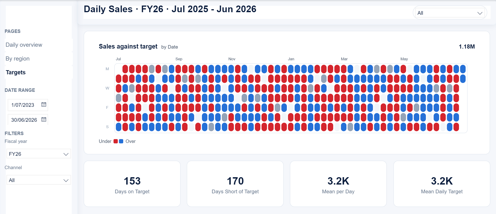
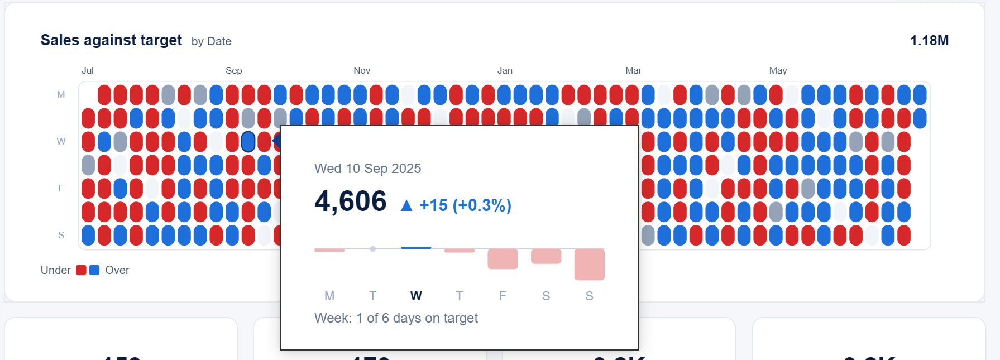
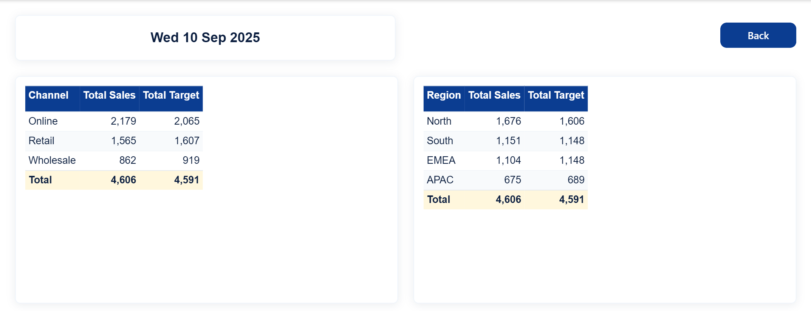

# Calendar Heatmap

A year of daily values in one view, for Power BI. The Calendar Heatmap is a Vega template for
[Deneb](https://deneb-viz.github.io/): week columns by weekday rows, each day coloured in steps of
the report theme's first colour, the peak day ringed, and every day a slicer. Drag across the days
and the rest of the page filters to that date range.

This repository holds the template and **Daily Sales**, a working five-page Power BI report built
on it in the BI Nexus theme. The design follows the Calendar Heatmap by
[Lumeric Visuals](https://lumericvisuals.com/visuals/calendar-heatmap). Nothing is copied from their
code, logo, copy or palette.

*Every screenshot here is Power BI Desktop running the report in this repository, on its synthetic
FY26 data.*

## What the Calendar does

### A year at a glance

- **Weeks by weekdays.** One column per week, Monday at the top, month labels above the weeks they
  start.
- **Five equal steps** of the theme's first colour, from 0 to the year's highest day, with a
  Less to More legend. Swap the ramp for five colours of your own in one setting.
- **Empty days read as empty, never as zero.** A day with no sales is drawn in a neutral grey.
- **The peak day is ringed**, here Thu 4 Dec.
- **A header** with the title, a subtitle naming the date field and the total for the year, in a
  compact format (1.18M, 367.7K).
- **Calendar or fiscal years.** This report draws the July to June fiscal year; any start month
  works.

### Drag to filter the page

A click selects one day and a drag selects every day from the first to the last. Here a drag from
7 July to 20 August 2025:

- sets the title to the range and the KPI strip to its values (148.3K, 3.3K a day, peak on 15 Aug,
  42 of 45 days with sales);
- lists the range's five best days in Top days;
- highlights July and August's share in Sales by month, keeping all twelve months;
- dims the days outside the range on the Support tickets and Web sessions Calendars, which take
  the highlight from their neighbour.

A click on the background clears it.

### Cell shapes and density

The same template draws all three Calendars on the Daily overview, each with its own settings.
Sales uses the default capsule cells. Support tickets uses square cells, and Web sessions the dense
spacing; both hide their legend. The header can be switched off too.

### Shared scale across Calendars

Four copies of the Calendar, one per region, coloured on one scale: a measure that repeats the
best single region-day of the year tops every Calendar's steps. The same colour means the same
sales in North and in APAC, so APAC's paler year is a real difference, not a rescaling.

### Target mode

Name a target field and each day is judged against it: the theme's good colour when sales meet or
beat the target, its bad colour when they fall short, grey when the day has no target. The
legend reads Under and Over. The cards count 153 days on target and 170 short in FY26.

### Report page tooltip

Every day carries its row's identity, so a report page tooltip works on any day. **Day summary**
tells the story at once:

- the day's sales, with the variance to target beside them in the good or bad colour;
- "No sales on this day" or "No target on this day" when that is the case;
- the Monday to Sunday week around it, one column per day's variance, the hovered day at full
  strength, and a count of the week's days on target.

The tooltip is its own small Deneb visual ([report/specs/day-summary.json](report/specs/day-summary.json)),
chosen from three prototypes.

### Drill through

Right click any day, then Drill through, then Day detail: the day's sales and target by channel and
by region, with a Back button.

## Use the template

Everything needed to add the Calendar to your own report is in
[template/calendar-heatmap/](template/calendar-heatmap/README.md): the fields to map, every
setting, setup in Deneb (advanced selection mode), the helper measure that brings in every date,
and the limits.

- Runs on Deneb 1.9 and 2.0. Highlight dimming from other visuals needs 2.0.
- Import `calendar-heatmap.json` in Deneb, map a date column and a measure, and it draws.

## The Daily Sales report

`report/Daily Sales.pbip` opens in Power BI Desktop with its data generated inside the model, so it
needs no data source. Its five pages:

| Page | What it shows |
|---|---|
| Daily overview | KPI strip, the sales, support tickets and web sessions Calendars, Sales by month, Top days |
| By region | One Calendar per region on a shared scale |
| Targets | The sales Calendar in target mode, and four target cards |
| Day summary | Hidden: the tooltip on every Calendar |
| Day detail | Hidden: the drill through from any day |

See [report/README.md](report/README.md) for the model's tables and measures and how every Deneb
visual is written.

## How it is tested

- **The template seam** (`harness/`, `npm test`, 479 checks): the spec in headless Edge under
  Vega 6.2 and 6.4 (Deneb 1.9 and 2.0) and in three time zones, with Deneb's own selection and
  highlight rules, plus the template library's offline checker.
- **The report seam** (`report/seam.ps1`): validates the report, applies it in Desktop, refreshes
  twice with one data fingerprint, screenshots every page and runs a DAX tie-out of every number the
  report shows against queries straight over the fact tables.
- **Acceptance in Desktop** (`report/desktop`, `npm run accept`, 15 checks): replays the drag,
  the background click, two hovers and a drill through in the running report and reads the
  results back.

## Layout

| Folder | What |
|---|---|
| `template/calendar-heatmap/` | The template in the Deneb template library's shape: `calendar-heatmap.json`, `sample-data.csv`, `render.json`, its README and preview |
| `report/` | The Daily Sales PBIP, its specs (`specs/`), the scripts that write its Deneb visuals and layout (`embed.py`, `layout.py`), the seam loop and tie-out (`seam.ps1`, `tieout.json`) and the Desktop driver (`desktop/`) |
| `harness/` | The template seam: the spec as a black box in headless Edge |
| `docs/images/` | The screenshots in this README |
| `evidence/` | Desktop evidence per ticket: screenshots, acceptance results and seam logs |
| `prototype/` | The first Vega spec and its render and interaction harness |
| `theme/` | The BI Nexus report theme |
| `reference/feasibility.json` | The feasibility study behind the spec |
| `SPEC.md` | The problem, user stories, decisions and testing approach |

## Status

Finished on 2026-09-27. The template, all five report pages and the three test seams are done.

- Deferred, and closed as not planned (reopen if wanted): rolling and multi-year windows, week
  start, in-spec small multiples, selection-limit handling, markers, value labels, and the
  in-Calendar KPI strip and month totals.
- Open: republishing and the pull request to the public
  [Deneb template library](https://github.com/InsightfulAnalytics/Deneb) (#29).

Learnings and notes live in the Vault, under `Vault\Projects\Calendar Heatmap\`.

## License

[MIT](LICENSE), the same as the Deneb template library.
