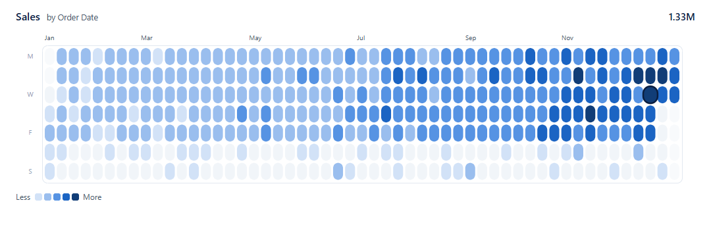

# Calendar heatmap prototype

A throwaway Vega spec. It shows that Deneb can draw a capsule-cell calendar heatmap after the
Calendar Heatmap by [Lumeric Visuals](https://lumericvisuals.com/visuals/calendar-heatmap). It is
not the template: #6 restructured it into the Template in `../template/calendar-heatmap/`, which is
where the work continues. It stays here unchanged, as the reference the harness's prototype checks
run on. The project spec (`SPEC.md` at the project root) describes the template and the working
report built from it.



## What to look at

| File | What it shows |
|---|---|
| `render-bi-nexus.png` | The spec at 1080 x 362 in the BI Nexus theme. The ramp is five shades of theme colour 1 (`pbiColor(0, shade)`), so it follows any report theme |
| `render-bi-nexus-drag.png` | The same view mid-drag, with the days outside the range dimmed |
| `compare.png` | Local only. The site's card, the first pass in the site's purple and the BI Nexus render, stacked |

## What it does

- One calendar year as 53 week columns by 7 weekday rows, Monday first. The week and weekday are
  worked out in the spec from the `Date` field.
- Five equal-interval colour classes over 0 to the year's maximum. Days with no data are drawn in
  a neutral grey, never as zero.
- The peak day gets a ring. There are month and weekday labels, a total, and a Less / More legend.
- A left click filters to one day, and a left drag filters to a date range. A click on the
  background clears the filter. It uses Deneb's advanced selection mode (`pbiCrossFilterApply` with
  an `inrange` predicate), which is why the spec is Vega, not Vega-Lite. A right click does not
  filter, so the context menu and drill-through still work.

## Checked so far

- The spec parses and renders under Deneb 1.9 and 2.0 rules (`render.mjs`).
- In headless Edge, with the Deneb functions shimmed, a drag from 7 Jul to 20 Aug matched 36
  dataset rows. A click on the peak matched 1 row, a right click made no call, and a background
  click cleared the filter.
- **Not yet run inside Power BI Desktop.** That happens in the working report.

## Render it again

```powershell
& ".\render.ps1"
```

`gen_data.py` writes the synthetic 2025 sales (`sample-data.csv`, `sample-data.json`), with about
1.33M in total, a December peak and 75 blank days. `render.ps1` runs `prep.py` (merges
`config.json`), the deneb-pbir `render.mjs` parse check, `browser_render.py` and `compare.py`.
