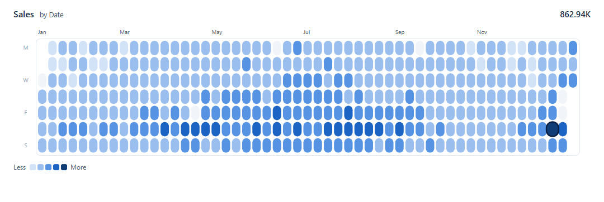

# Calendar Heatmap

A year of daily values in one view: week columns by weekday rows, Monday at the top, each day
coloured in one of five equal steps of the report theme's first colour. Days with no value are
drawn in a neutral grey, never as zero, the peak day is ringed, and a click or a drag across the
days cross-filters the page to those dates.

## Fields

| Name | Kind | Type | Description |
|---|---|---|---|
| Date | column | dateTime | The day: a date column, such as the date table's date. One row per day. |
| Sales | measure | numeric | The day's value: a non-negative measure, such as total sales. |

Map any date column and any measure: the names above are only the placeholders' names. Both are
read by bracket access, so a field name with spaces works. An optional column (a target, or a
shared scale top) is not a placeholder: add it to the Values well and name it in `targetField` or
`scaleField`.

The date may arrive as a date, a date-time at midnight, an epoch number or ISO text
(`2025-07-01`). Each resolves to the same calendar day in every time zone. A date-time that falls
exactly on UTC midnight is read as that UTC date; any other time is read as the local date.

## Settings

Every setting is a signal at the top of the spec, from `titleText` to `badColor`. Change the value
in place. The signals after `badColor` are the spec's own working and need no editing.

| Setting | Default | What it changes |
|---|---|---|
| `titleText` | the value field's name | The header title. |
| `subtitleText` | `by ` and the date field's name | The header subtitle. |
| `windowMode` | `calendar` | `calendar` draws the calendar year holding the latest date; `fiscal` draws the fiscal year holding it. |
| `fiscalStartMonth` | `7` | The fiscal year's first month, 1 to 12 (7 is July). Used when `windowMode` is `fiscal`. |
| `everyDateHasRow` | `false` | Off: a day with no row is an empty day. On: the report guarantees a row for every date, so a day with no row was removed by a filter and draws as filtered out. |
| `rampShades` | `[0.8, 0.55, 0.25, -0.1, -0.45]` | The five steps, as shades of theme colour 1 from light to dark. |
| `palette` | `pbiColor(0, rampShades[i])` for each step | The five step colours. Replace with five colours of your own to leave the theme. |
| `emptyColor` | `#f1f5f9` | Fill of an empty day (no value). |
| `filteredOutColor` | `#cbd5e1` | Outline of a filtered-out day, which has no fill. |
| `inkColor` | `#0b1e3f` | Title, total and Peak day ring. |
| `mutedColor` | `#475569` | Subtitle, month labels and legend text. |
| `faintColor` | `#94a3b8` | Weekday labels. |
| `frameColor` | `#e2e8f0` | The frame around the grid. |
| `padL`, `padR`, `padT`, `padB` | `24`, `24`, `14`, `12` | Padding inside the visual, in pixels. |
| `gutter` | `40` | Space for the weekday labels, left of the grid. |
| `insetR` | `20` | Space right of the grid. |
| `fpad` | `4` | Space between the frame and the days. |
| `gapRatio` | `0.21` | The gap between days, as a share of a day's width. `0.21` is regular; `0.1` is dense. |
| `maxAspect` | `1.72` | The tallest a day may be, as a multiple of its width. |
| `cellShape` | `capsule` | `capsule` rounds each day by half its width; `square` uses a 2-pixel corner. The Peak day ring follows. |
| `showHeader` | `true` | Off: no title, subtitle or total, and the month labels and grid move up into the space. |
| `showLegend` | `true` | Off: no legend, and the grid takes its height. |
| `scaleField` | `""` (off) | The name of a field whose largest value over the Window tops the steps, such as a measure that repeats the highest day across every region, so separate Calendars share one scale. Blank or zero falls back to the Window's own maximum. The Peak day stays the Window's highest day. |
| `targetField` | `""` (off) | The name of a target field. A day with a value draws in `goodColor` when it meets or beats its target and in `badColor` when it falls short; a day with no target draws in `faintColor`. Empty and filtered-out days are unchanged, the legend reads Under and Over, the Peak day ring is off, and the tooltip adds the target. |
| `goodColor` | `pbiColor('positive')` | Target mode's met colour: the theme's good (positive) colour. |
| `badColor` | `pbiColor('negative')` | Target mode's missed colour: the theme's bad (negative) colour. |

## Setup

1. In Deneb's format pane, set selection mode to **advanced**, and check that **cross-highlight**,
   **tooltips** and the **context menu** are on. The template's metadata turns tooltips, context
   menu, selection and highlight on, but a version 1 template cannot set advanced mode, so an
   imported copy arrives in simple mode: a click selects a day, and a drag does nothing until you
   switch. Selection and highlight are on here, unlike the library's house default of off, because
   they are what this visual is for: a drag cross-filters the page to a date range, and a highlight
   from another visual dims the days it leaves out.
2. Add a Deneb visual and put a date column and a measure in its Values well. Bind the date as a
   plain column, not the auto date/time hierarchy.
3. Open the editor, create a new specification from a template (Import), pick
   `calendar-heatmap.json` and map the two fields.

**Every date, with a helper measure.** Power BI drops a row when every measure on it is blank, so a
day with no sales arrives with no row: it draws as an Empty day with no row identity, so it has no
tooltip, context menu or selection. To bring every date in, bind a measure that is never blank
beside the value, such as a count of the date table's rows (`COUNTROWS('Date')`), and set
`everyDateHasRow` to `true`. Each day then has its own row, blank days included, and a day that is
missing was removed by a filter and draws as filtered out (hollow). The fallback, "Show items with
no data" on the date field, is untested with this template.

**Interaction.** A left click selects a day; a drag selects the run of days from the first to the
last, in calendar order. A click on the background, outside the grid, clears the selection; a
click in the grid that misses a day sends nothing. Shift behaves as Deneb's advanced selection
does. The selected days stay full strength and the rest dim. A report page tooltip works on any
day that has a row: each day carries its row's identity. Set the visual's tooltip type to Canvas
and give it a tooltip page.

## Limits

- One band: the Window is the one year (calendar, or fiscal) that holds the latest date.
- The measure should be non-negative: values at or below zero fall in the lowest step.
- One row per day: when several rows share a date, one of them is drawn.
- A selection sends at most 2,500 rows, the most Deneb accepts. A drag over more is refused and
  the previous selection stays.
- Smallest readable size: about 500 by 200 pixels, where a day is about 6 pixels wide. Smaller
  than that the days are hard to aim a click at, and nothing switches off to make room.

## Compatibility

Runs on Deneb 1.9 and 2.0. It reads the container size through `pbiContainerWidth` and
`pbiContainerHeight`, in the top-level width and height only, which Deneb 2.0 still accepts. A
year of days is at most 366 rows, well inside Deneb's row window (10,000 rows on 1.9, 30,000 on
2.0).

Cross-highlight from other visuals needs Deneb 2.0, which delivers the value field's highlight
companion. Days another visual's highlight leaves out are dimmed; Empty days keep their look. Under
Deneb 1.9, or with highlight off, nothing dims.

Renderer: SVG is recommended, for crisp outlines on Filtered-out days and text at any zoom. Canvas
also works and draws the same scene.

## Export

An export renders the visual afresh, so a drag in progress or a hover is never captured. Whether an
active selection carries into an export is unverified. The visual never scrolls, so an export shows
the whole year.

## Credit

Design after Lumeric Visuals ([lumericvisuals.com](https://lumericvisuals.com)). This template is
an independent Deneb reimplementation, with its own spec and invented data. What differs from the
original:

- Colours come from the report theme: the steps are shades of theme colour 1, and target mode uses
  the theme's good and bad colours.
- Fonts are Segoe UI, Power BI's own, set in the spec's config.
- Month labels are aligned to the week column that holds each month's first day.
- The steps are equal intervals from zero to the Window's maximum.
- The Peak day ring is inset: the peak day is redrawn in its own step colour with a dark outline,
  within its row, rather than ringed from outside.

## Licence

MIT.
